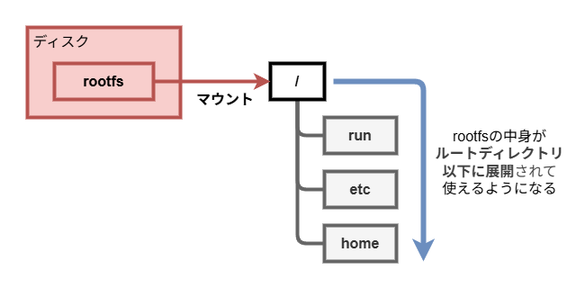

# 4-1. マウントとrootfs

ここからは**rootfs** (ルートファイルシステム) に関する処理を実装していきます。  
実装に入る前に、[1章](/1-basics/)でも少し触れた**マウント**と**rootfs**について、もう少し深掘りしてみましょう。

## マウント

マウントは、何らかの**ファイルシステム**を特定の**ディレクトリに紐付ける**操作です。

ここで、**ファイルシステム**についておさらいしておきましょう。  
ファイルシステムは、コンピューターが**ストレージ**にどのように**データを読み書きするか**を定義する仕組みです。  
私たちが普段使っている**ディレクトリ・ファイルの構造**をストレージに書き込み・読み込みする際、**どう変換されるか**を決めています。  
代表的なファイルシステムの規格をいくつか紹介します。

- **ext4**: Linuxでよく使われるファイルシステム
- **FAT32**: USBメモリやSDカードでよく使われるファイルシステム
- **NTFS**: Windowsの標準ファイルシステム

ファイルシステムを持つ「何か」は、**マウント操作**を用いて特定のディレクトリに紐付けることで、実際に私たちがOSの中で**ファイル・ディレクトリとして操作できる**ようになります。  
「ファイルシステムを持つ『何か』」は多くの場合HDDやSSDなどの**ストレージデバイス**や**ネットワーク越しの共有ディレクトリ** (NASなど) です。

## rootfsと`/` (ルートディレクトリ)

LinuxなどのUNIX系OSにおいて、OS全体のディレクトリ構造の土台となるのが**rootfs**。  
rootfsは、`/` (ルートディレクトリ) の**中身が全て入った**ファイルシステムです。

ここで注意したいのが、**rootfs**と**ルートディレクトリ**は**別物**だということ。  
rootfs (ルートファイルシステム) と呼ばれる**ファイルシステム**を、`/` (ルートディレクトリ) に**マウント**することで、みなさんは`/`以下のディレクトリ・ファイルを使えるようになるのです。

また、これらとは別に**見かけ上のルートディレクトリ**という概念があります。  
見かけ上のルートディレクトリとは、ある**プロセス**が**ルートだと認識するディレクトリのこと**です。  
基本`/`に設定されていますが、見かけ上のルートディレクトリは**任意のディレクトリに変更**できます ([4-2](/4-rootfs/2-chroot/))。

rootfs、 `/` (ルートディレクトリ)、見かけ上のルートディレクトリという**3つの要素**が揃って、私たちは初めて普段使っているファイル群にアクセスできるようになるのです。

## 特殊なファイルシステム

先ほど紹介した通り、多くの場合マウントされるファイルシステムはストレージデバイスやネットワーク越しの共有ディレクトリですが、Linuxでは他にも**特殊なファイルシステム**をマウントすることができます。

### バインドマウント

**特定のディレクトリ**をファイルシステムとして扱い、別のディレクトリに紐付けるマウントです。  
コンテナで、**ホストマシン**のディレクトリ・ファイルを**コンテナ内でも**扱いたいとき「バインドマウント」をしますが、これがまさにその例です。

挙動としてはシンボリックリンクに近いですが、実体は全く異なり、**ファイルシステム操作の自由度**を格段に上げてくれる、非常に便利なマウントタイプです。  
この後の実装でも、バインドマウントを多用します。

### オーバーレイマウント (OverlayFS)

複数のファイルシステムを**重ねて**、**1つのファイルシステム**として扱うマウントです。  
詳しいことはここでは取り扱いませんが、Production Readyなコンテナランタイムにて使われています。

### procfs

**カーネル内の情報をファイルとして読み書き**できるようにした、**仮想的**なファイルシステムです。  
procfsは主に**プロセスの情報**を扱います。  
Linuxでは必ず`/proc`にマウントされています。「仮想的」なので、procfsの (`/proc`以下の) ファイルはストレージ上には**存在せず**、**RAM上**に実体があります。

カーネルが動的に書き込む**プロセスの状態をリアルタイムに読める**ほか、procfsのファイルに書き込むことで**プロセスの設定を書き換える**ことも可能です。

### sysfs

procfsと同様、カーネル内の情報をファイルとして読み書きできるようにした、仮想的なファイルシステムです。  
sysfsは主に**カーネルデバイス・ドライバ**等の情報を扱います。  
Linuxでは必ず`/sys`にマウントされています。これもストレージ上には**存在せず**、**RAM上**に実体があります。
