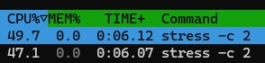
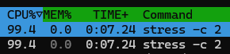

# 5-3. CPUとメモリを制限する

前節で追加したcgroupに対して、CPUとメモリの使用量を制限してみましょう！

## 親cgroupで、子cgroupのCPUとメモリの管理を許可する

子cgroupに対して**コントローラーを有効化** (リソース管理を許可) するには、親cgroupの`cgroup.subtree_control`に対して、**対象のコントローラー名を追加**する必要があります。

前節で追加したcgroupの親cgroup (`/sys/fs/cgroup`) に対して、CPUとメモリの管理を許可してみましょう！

:::details ヒント
`cgroup.subtree_control`に対して、**`+{リソース名}`と書き込む**ことで、子cgroupでのリソース管理が許可されます。  
今回は、CPUとメモリの管理を許可するので、`+cpu +memory`と書き込めばOKです。
:::

### 想定解答

:::details 想定解答

```go
const CgroupRoot = "/sys/fs/cgroup"

func SetupCgroup(name string, pid int, c CgroupConfig) error {
  // cgroupの大元に、子cgroupでのCPUとメモリの管理を許可 // [!code ++]
  if err := os.WriteFile(filepath.Join(CgroupRoot, "cgroup.subtree_control"), []byte("+cpu +memory"), 0o700); err != nil { // [!code ++]
    return errors.WithStack(err) // [!code ++]
  } // [!code ++]

  // コンテナ用の子cgroup作成 (同名の子cgroupディレクトリがあれば削除)
  //  ディレクトリを作成した時点で、cgroupで操作可能なリソースに対応するファイルが生成される
  if err := os.RemoveAll(filepath.Join(CgroupRoot, name)); err != nil {
    return errors.WithStack(err)
  }
  if err := os.MkdirAll(filepath.Join(CgroupRoot, name), 0o755); err != nil {
    return errors.WithStack(err)
  }

  // 今回コンテナにするプロセスをcgroupに追加
  if err := os.WriteFile(filepath.Join(CgroupRoot, name, "cgroup.procs"), []byte(strconv.Itoa(pid)), 0o755); err != nil {
    return errors.WithStack(err)
  }

  return nil
}
```

:::

## CPU使用量を制限する

いよいよ、子cgroupに対して**CPU使用量の制限**を設定してみましょう。  
CPU使用量の制限は、`cpu.max`というファイルで制御されているので、ここに適切な値を書き込んでみましょう。

CPU使用率の上限は、`CgroupConfig`構造体の`MaxCpuPercent`フィールドとして関数に渡されます。

```go
// cgroup設定
type CgroupConfig struct {
  // CPU使用率の上限 (パーセント)
  MaxCpuPercent int `json:"max_cpu_percent"`
  // メモリ使用量の上限 (バイト)
  MaxMemory int `json:"max_memory"`
}
```

:::details ヒント1
CPU使用率の上限は、`cpu.max`に対して、**`{上限値} {期間}`のフォーマットで書き込む**ことで設定できます。

- **期間** (period): 測定・再割り当ての**基準となる期間**
  - 単位は**マイクロ秒**
  - デフォルトは通常**100000＝100ms**
- **上限値** (quota): 期間内に使用できる**CPU時間**の上限
  - 単位は**マイクロ秒**
  - `上限値 = 期間 × CPU使用率 (割合)`で計算できます。

例:

- `50000 100000`: **0.5コア**相当
- `100000 100000`: **1コア**相当
- `200000 100000`: **2コア**相当

:::

:::details ヒント2
今回はCPU使用率の上限を**パーセントで指定**するので、以下のように上限値を計算します。

`上限値 = 期間 × CPU使用率 (パーセント) / 100`
:::

### 想定解答

:::details 想定解答

```go
const CgroupRoot = "/sys/fs/cgroup"

func SetupCgroup(name string, pid int, c CgroupConfig) error {
  // cgroupの大元に、子cgroupでのCPUとメモリの管理を許可
  if err := os.WriteFile(filepath.Join(CgroupRoot, "cgroup.subtree_control"), []byte("+cpu +memory"), 0o700); err != nil {
    return errors.WithStack(err)
  }

  // コンテナ用の子cgroup作成 (同名の子cgroupディレクトリがあれば削除)
  //  ディレクトリを作成した時点で、cgroupで操作可能なリソースに対応するファイルが生成される
  if err := os.RemoveAll(filepath.Join(CgroupRoot, name)); err != nil {
    return errors.WithStack(err)
  }
  if err := os.MkdirAll(filepath.Join(CgroupRoot, name), 0o755); err != nil {
    return errors.WithStack(err)
  }

  // 今回コンテナにするプロセスをcgroupに追加
  if err := os.WriteFile(filepath.Join(CgroupRoot, name, "cgroup.procs"), []byte(strconv.Itoa(pid)), 0o755); err != nil {
    return errors.WithStack(err)
  }

  // CPUの上限を設定 // [!code ++]
  period := 100000 // [!code ++]
  quota := c.MaxCpuPercent * period / 100 // [!code ++]

  payload := fmt.Sprintf("%d %d", quota, period) // [!code ++]
  if err := os.WriteFile(filepath.Join(CgroupRoot, name, "cpu.max"), []byte(payload), 0o755); err != nil { // [!code ++]
    return errors.WithStack(err) // [!code ++]
  } // [!code ++]

  return nil
}
```

:::

## CPU使用量が制限されていることを確かめる

実際にCPU使用量が制限されていることを確認してみましょう。

以下の例は、CPU使用率の上限を**100%に設定**した場合です。  
`stress`コマンドを使って**2プロセスでCPU負荷** (2コア分消費するはず) をかけても、合計のCPU使用率が**100%を超えない**ことが確認できます。

::: warning プログラム実行用シェル

```console
$ sudo su
# make run
go build -o main *.go
./main run bash
# apt update && apt install stress    ← 負荷をかけるために使うstressコマンドを用意
... (インストールログ) ...
# stress -c 2                         ← 2コア分のCPU負荷をかける
stress: info: [94119] dispatching hogs: 2 cpu, 0 io, 0 vm, 0 hdd
```

:::

コンテナが立ち上がったら、挙動確認用シェルで`top`、`htop`、`mpstat`などのコマンドを使い、CPU使用率を見てみましょう。



このスクリーンショットのように、**2プロセスでCPU負荷**をかけても、合計のCPU使用率が**100%を超えな**ければ成功です。

なお、コンテナを抜けてから改めて`stress -c 2`を実行した場合、2つのプロセスが**それぞれ約100%のCPUを使用**しているのが確認できます。



## メモリ使用量を制限する

CPUに続き、**メモリ使用量の制限**も設定してみましょう。  
メモリ使用量の制限は、`memory.max`というファイルで制御されているので、ここに適切な値を書き込んでみましょう。  
また、今回は**スワップも無効**にしましょう。スワップは、`memory.swap.max`というファイルで制御されており、ここに`0`を書き込むことでスワップを無効化できます。

メモリ使用量の上限は、`CgroupConfig`構造体の`MaxMemory`フィールドとして関数に渡されます。

```go
// cgroup設定
type CgroupConfig struct {
  // CPU使用率の上限 (パーセント)
  MaxCpuPercent int `json:"max_cpu_percent"`
  // メモリ使用量の上限 (バイト)
  MaxMemory int `json:"max_memory"`
}
```

:::details ヒント
メモリ使用量の上限は、`memory.max`に上限値 (**バイト単位**) を書き込むことで設定できます。
:::

### 想定解答

:::details 想定解答

```go
const CgroupRoot = "/sys/fs/cgroup"

func SetupCgroup(name string, pid int, c CgroupConfig) error {
  // cgroupの大元に、子cgroupでのCPUとメモリの管理を許可
  if err := os.WriteFile(filepath.Join(CgroupRoot, "cgroup.subtree_control"), []byte("+cpu +memory"), 0o700); err != nil {
    return errors.WithStack(err)
  }

  // コンテナ用の子cgroup作成 (同名の子cgroupディレクトリがあれば削除)
  //  ディレクトリを作成した時点で、cgroupで操作可能なリソースに対応するファイルが生成される
  if err := os.RemoveAll(filepath.Join(CgroupRoot, name)); err != nil {
    return errors.WithStack(err)
  }
  if err := os.MkdirAll(filepath.Join(CgroupRoot, name), 0o755); err != nil {
    return errors.WithStack(err)
  }

  // 今回コンテナにするプロセスをcgroupに追加
  if err := os.WriteFile(filepath.Join(CgroupRoot, name, "cgroup.procs"), []byte(strconv.Itoa(pid)), 0o755); err != nil {
    return errors.WithStack(err)
  }

  // CPUの上限を設定
  period := 100000
  quota := c.MaxCpuPercent * period / 100

  payload := fmt.Sprintf("%d %d", quota, period)
  if err := os.WriteFile(filepath.Join(CgroupRoot, name, "cpu.max"), []byte(payload), 0o755); err != nil {
    return errors.WithStack(err)
  }

  // メモリの上限を設定 // [!code ++]
  payload = strconv.Itoa(c.MaxMemory) // [!code ++]
  if err := os.WriteFile(filepath.Join(CgroupRoot, name, "memory.max"), []byte(payload), 0o755); err != nil { // [!code ++]
    return errors.WithStack(err) // [!code ++]
  } // [!code ++]
  if err := os.WriteFile(filepath.Join(CgroupRoot, name, "memory.swap.max"), []byte("0"), 0o755); err != nil { // [!code ++]
    return errors.WithStack(err) // [!code ++]
  } // [!code ++]

  return nil
}
```

:::

## メモリ使用量が制限されていることを確かめる

実際にメモリ使用量が制限されていることを確認してみましょう。

以下の例は、メモリ使用量の上限を**200MBに設定**した場合です。  
`stress`コマンドを使って**1GB分のメモリ確保**に挑戦すると、**OOM Kill**が発生してプロセスが**強制終了**されることが確認できます。

```console
$ sudo su
# make run
go build -o main *.go
./main run bash
# stress -m 1 --vm-bytes 1G       ← 1GB分のメモリ確保に挑戦 (失敗する)
stress: info: [74] dispatching hogs: 0 cpu, 0 io, 1 vm, 0 hdd
stress: FAIL: [74] (425) <-- worker 75 got signal 9
stress: WARN: [74] (427) now reaping child worker processes
stress: FAIL: [74] (461) failed run completed in 1s
# dmesg -T | grep -i oom          ← OOM Killerのログを確認
... (省略) ...
[Wed Sep 16 17:51:34 2026] stress invoked oom-killer: gfp_mask=0xcc0(GFP_KERNEL), order=0, oom_score_adj=0
[Wed Sep 16 17:51:34 2026]  oom_kill_process+0x106/0x230
[Wed Sep 16 17:51:34 2026] [  pid  ]   uid  tgid total_vm      rss rss_anon rss_file rss_shmem pgtables_bytes swapents oom_score_adj name
[Wed Sep 16 17:51:34 2026] oom-kill:constraint=CONSTRAINT_MEMCG,nodemask=(null),cpuset=container,mems_allowed=0,oom_memcg=/container,task_memcg=/container,task=stress,pid=4040,uid=0
[Wed Sep 16 17:51:34 2026] Memory cgroup out of memory: Killed process 4040 (stress) total-vm:1052536kB, anon-rss:193536kB, file-rss:592kB, shmem-rss:0kB, UID:0 pgtables:440kB oom_score_adj:0
```

`stress`コマンドが`worker {worker番号} got signal 9` (Signal 9は**SIGKILL**) というログを吐いて**強制終了**されていることが確認できますね。  
OOM Killerのログには`Memory cgroup out of memory: Killed process {PID} (stress)`と表示され、**cgroupのメモリ制限に引っかかった**ことがわかります。

なお、150MB程度のメモリ確保であれば、OOM Killは発生せず正常に実行できるはずです。
